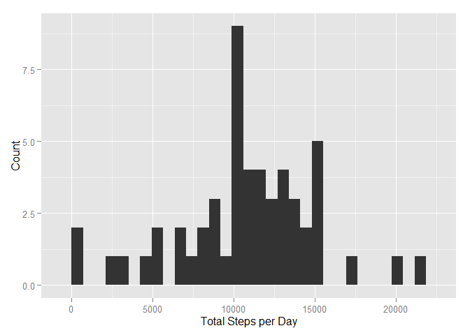
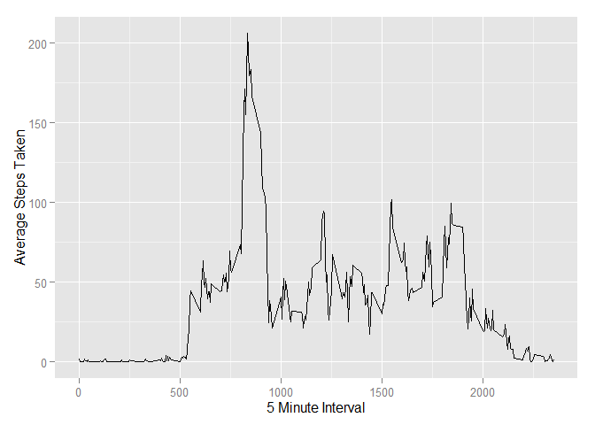
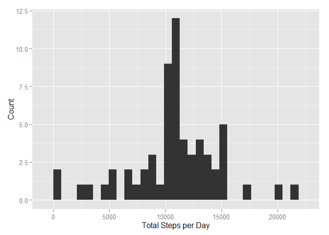
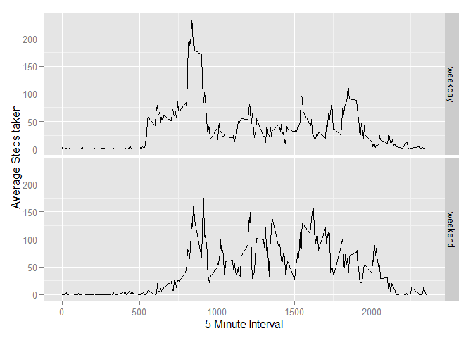

# Reproducible Research: Peer Assessment 1

##Loading and preprocessing the data

Reading the data and loading ggplot2 package for plotting.


```r
activity<-read.csv("activity.csv")

library(ggplot2)
```


##What is mean total number of steps taken per day?

For this purpose, missing values (NA's) are ignored. The total daily steps per day is calculated and histogram is plotted.


```r
dailysteps<-aggregate(steps~date,activity,sum)

qplot(steps,data=dailysteps,geom="histogram",xlab="Total Steps per Day",ylab="Count")
```

 

Mean of the total steps taken per day:

```r
mean(dailysteps$steps)
```

```
## [1] 10766.19
```

Median of the total number of steps taken per day:

```r
median(dailysteps$steps)
```

```
## [1] 10765
```


##What is the average daily activity pattern?

Calculating the average steps taken over all the 5-minute intervals and creating a time series plot.


```r
intervalsteps<-aggregate(steps~interval,activity,mean)

qplot(interval,steps,data=intervalsteps,geom="line",xlab="5 Minute Interval",ylab="Average Steps Taken")
```

 

The following code returns the row with the highest average number of steps and its corresponding 5 minute interval.


```r
maxstepsinterval<-intervalsteps[which.max(intervalsteps$steps),]
maxstepsinterval
```

```
##     interval    steps
## 104      835 206.1698
```

The 835th 5-minute interval contains the maximum number of steps (206.1698113).

##Imputting missing values

The number of rows in the activity dataset with missing (NA) values is calculated as follows:

```r
sum(is.na(activity$steps))
```

```
## [1] 2304
```

To replace missing (NA) values, any NA value is replaced with the mean of total steps taken across the activity dataset. The Hmisc package is loaded to simplify the imputation process.


```r
library(Hmisc)
imputedsteps<-activity
imputedsteps$steps<-impute(activity$steps,mean)
```

The total daily steps per day is calculated with the new imputed information and histogram is plotted.


```r
imputeddailysteps<-aggregate(steps~date,imputedsteps,sum)

qplot(steps,data=imputeddailysteps,geom="histogram",xlab="Total Steps per Day",ylab="Count")
```

 

Mean of the total steps taken per day:

```r
mean(imputeddailysteps$steps)
```

```
## [1] 10766.19
```

Median of the total number of steps taken per day:

```r
median(imputeddailysteps$steps)
```

```
## [1] 10766.19
```

From the above, there is only a minimal difference between the means and medians of the total number of steps taken per day when compared between the original and imputed datasets.

##Are there differences in activity patterns between weekdays and weekends?

A new factor variable (day) is created to identify if a given date is on a weekday or weekend day. The following code creates the new factor variable (day), then uses the as.POSIXlt $wday function where 0-6 are the given numbers of the days of the week where 0 is Sunday and 6 is Saturday. Days 1-5 are the weekdays Monday-Friday.


```r
activity$day <-  ifelse(as.POSIXlt(activity$date)$wday %in% c(0,6), 'weekend', 'weekday')
```

A new dataset (averageactivity) is created to show the average steps taken for each interval, split between weekdays and weekends.


```r
averageactivity<-aggregate(steps~interval+day,data=activity, mean)
```

The panel plot is created to show the difference in activity patterns between weekdays and weekends.


```r
ggplot(averageactivity, aes(interval, steps))+
        geom_line()+
        facet_grid(day~.)+
        xlab("5 Minute Interval")+
        ylab("Average Steps taken")
```

 
